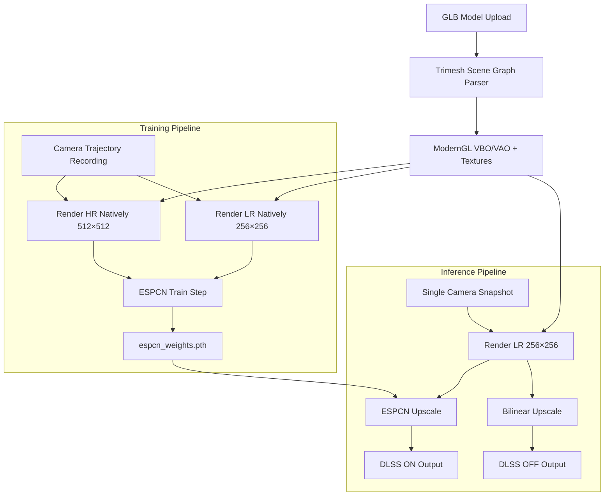
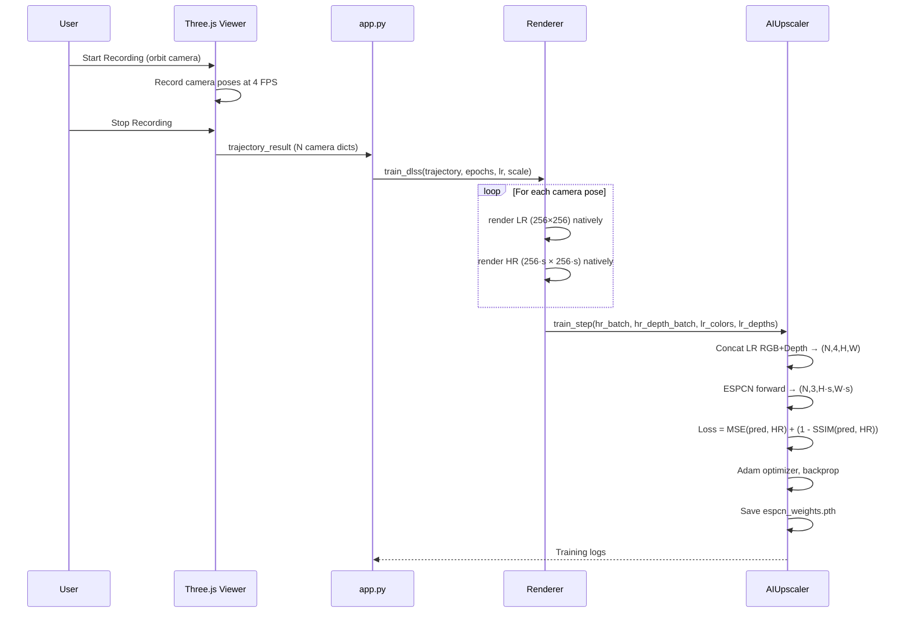
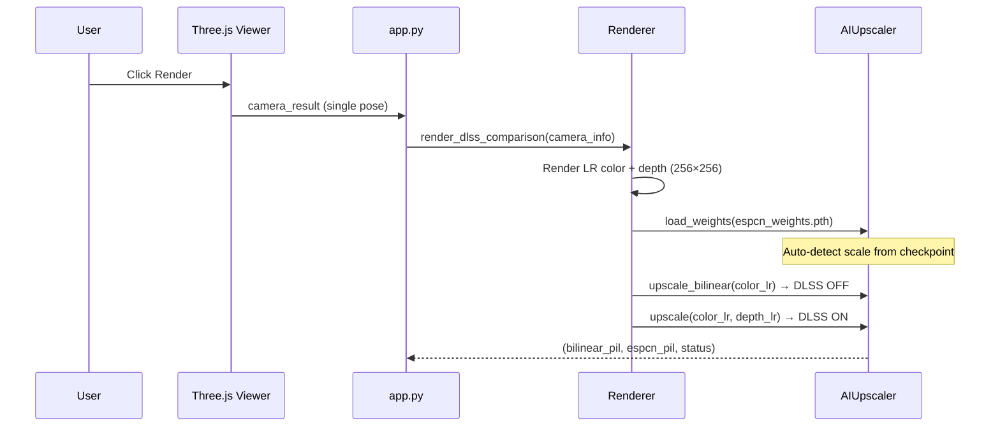

# DIY-DLSS：3D 場景的即時 AI Upscale 技術比較

這是一個客製化實作的 DLSS (Deep Learning Super Sampling)，透過 headless ModernGL renderer 原生算繪的 low/high-resolution 影格配對來訓練 neural network，並在 inference time 應用學習到的 upscaling。

## 架構概述 (Architecture Overview)



## 專案結構 (Project Structure)

```
├── app.py                          # Gradio web app, JS↔Python bridge
├── pipeline/
│   ├── camera/Camera.py            # View & projection matrix generation
│   ├── model/dlss_model.py         # ESPCN model, AIUpscaler wrapper
│   ├── renderer/Renderer.py        # Headless ModernGL render engine
│   ├── shader/shader.py            # GLSL vertex & fragment shaders
│   ├── scene/Scene.py              # Scene state container
│   └── utils/utils.py              # File I/O helpers
└── web_viewer/web/
    ├── three_viewer.html           # Three.js viewer (iframe)
    ├── three_script.js             # OrbitControls, camera relay, trajectory recording
    └── style.css / three_style.css
```

## 核心組件 (Key Components)

### 1. Renderer (`pipeline/renderer/Renderer.py`)

使用 **ModernGL standalone context** 的 Headless OpenGL renderer。所有的 GPU 工作都會透過 `queue.Queue` 在專屬的 worker thread 上執行，以避免 OpenGL context 的 threading 問題。

| 方法 (Method) | 描述 (Description) |
|---|---|
| `init_gl()` | 建立 standalone ModernGL context，編譯 shaders，並配置 FBO |
| `_prepare_scene(path)` | 透過 Trimesh 載入 `.glb`，使用 `dump()` 展平 scene graph，並建立綁定 texture 的 per-material VBO/VAO batches |
| `_render_scene_to_fbo(cam)` | 將所有 batches 算繪到 FBO，並讀回 color (uint8→float32) 和 linearized depth |
| `_render_dlss_comparison(cam_info)` | 從單一 LR render 產生 Bilinear 與 ESPCN upscaled 的比較結果 |
| `_train_dlss(trajectory, ...)` | 針對每個 camera pose **原生算繪 LR 與 HR**，並將配對資料餵給 ESPCN 進行訓練 |

**Scene Graph 處理**：使用 `trimesh.Scene.dump()` 取代 `geometry.values()`，以正確套用來自 GLB 檔案的 hierarchical node transforms。

**多批次算繪 (Multi-Batch Rendering)**：每個 material/texture 都有自己的 VBO + VAO。在算繪過程中，textures 會透過 `u_use_texture` uniform 切換以 per-batch 方式綁定。

### 2. Camera (`pipeline/camera/Camera.py`)

將 Python 端的 rendering 與 Three.js frontend camera 同步。

| 方法 (Method) | 描述 (Description) |
|---|---|
| `Camera.from_threejs(dict)` | Factory：從 frontend 解析 `{position, rotation, target, fov, near, far, mode}` |
| `get_view_matrix()` | 計算 4×4 lookAt matrix。針對 third-person (OrbitControls) 使用 `target`，針對 first-person 使用 Euler angles |
| `get_projection_matrix()` | 透過 FOV, aspect, near/far 計算標準的 perspective projection |

### 3. ESPCN Model (`pipeline/model/dlss_model.py`)

針對 depth-guided super resolution 改編的 **Efficient Sub-Pixel Convolutional Neural Network** (Shi et al., 2016)。

```
Input: (B, 4, H, W)  ← RGB + Depth
  ↓ Conv2d(4 → 64, k=5)  + ReLU
  ↓ Conv2d(64 → 32, k=3) + ReLU
  ↓ Conv2d(32 → 3·s², k=3)
  ↓ PixelShuffle(s)
Output: (B, 3, H·s, W·s)  ← Upscaled RGB
```

| 類別 / 方法 (Class / Method) | 描述 (Description) |
|---|---|
| `ESPCN(scale_factor, in_channels=4)` | 具備 sub-pixel convolution 的 PyTorch model |
| `AIUpscaler.load_weights(path)` | 從 checkpoint tensor 的形狀自動偵測 scale factor；如果 scale 不符，會重建 model |
| `AIUpscaler.train_step(hr, hr_d, ..., lr_colors, lr_depths)` | 使用 **原生算繪的** LR/HR 配對進行訓練（消除 bicubic domain gap）。Loss = MSE + (1 − SSIM) |
| `AIUpscaler.upscale(color, depth)` | Inference：串接 RGB+depth，執行 ESPCN，回傳 float32 numpy |
| `AIUpscaler.upscale_bilinear(color)` | Baseline：PIL bilinear resize |

**自動 Scale 偵測**：`load_weights()` 會檢查 `net.4.weight.shape[0]` 來推斷 `scale = sqrt(out_channels / 3)`。如果載入的 scale 與目前的 model 不同，會在載入 weights 前重建 ESPCN 架構。

### 4. Shaders (`pipeline/shader/shader.py`)

| Shader | 詳細資訊 (Details) |
|---|---|
| **Vertex** | 透過 `u_model × u_view × u_proj` 轉換 vertices，並傳遞 world position, normal, UV |
| **Fragment** | 具有 **directional sunlight** `(0.5, 1.0, 0.3)` 的 Blinn-Phong。Ambient=0.5, Diffuse=0.6, Specular=0.1。Texture 透過 `u_use_texture` 切換來 sampling |


## 訓練流程細節 (Training Pipeline Detail)



## 推論流程細節 (Inference Pipeline Detail)



## 安裝與執行 (Setup)

```bash
conda env create -f environment.yml
conda activate cg_hw3
python app.py
```

應用程式將會在 `http://127.0.0.1:8000` 啟動，並附帶 Gradio share link。

- macOS需要下載torch cpu only版本，詳細查看environment.yml

